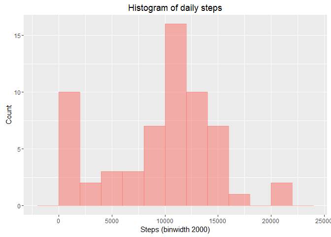
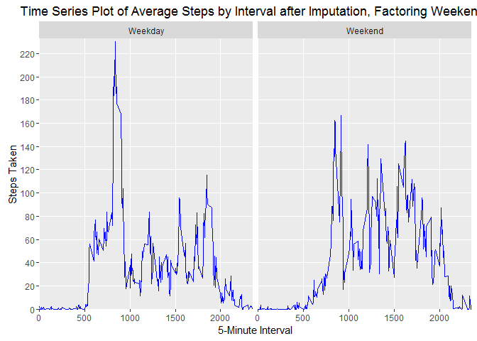

# Reproducible Research: Peer Assessment 1

## Preloading steps

Here we load all the libraries that need to be loaded and set any global options.


```r
library(ggplot2)
library(scales)
```


## Loading and preprocessing the data

Here we unzip the file "activity.zip" and extract the data. Then we load that data into the data frame _activity.data_
so we can use it.


```r
if(!file.exists("activity.csv")) {unzip("activity.zip")}

# Read the data
activity.data <- read.csv("activity.csv", colClasses = c("numeric", "Date", "numeric"))
```


## What is mean total number of steps taken per day?
Here we calculate the mean total number of steps taken in a day across the entire time period. We aggregate the value of teps taken across the days and then take a mean.


```r
steps.per.day <- with(activity.data, aggregate(steps, by = list(date), FUN = sum, na.rm = T))
names(steps.per.day) <- c("date", "steps")
histplot <- ggplot(steps.per.day, aes(x = steps, colour = "red", fill = "red", alpha = 0.2)) +
            ggtitle("Histogram of daily steps") +
            xlab("Steps (binwidth 2000)") +
            ylab("Count") +
            geom_histogram(binwidth = 2000) + 
            theme(legend.position = "none")
histplot
```



We calculate the mean of total steps taken over the time period, ignoring the missing values.


```r
mean.steps <- mean(steps.per.day$steps, na.rm = T)
mean.steps
```

```
## [1] 9354.23
```

We also calculate the median of steps taken.


```r
median.steps <- median(steps.per.day$steps, na.rm = T)
median.steps
```

```
## [1] 10395
```

As we can see, the mean of steps taken during any day is 9354.23 and the median is 10395.

## What is the average daily activity pattern?

We calculate the average daily activity using the intervals, so we can find out how an average day went down.


```r
average.steps.per.interval <- with(activity.data, aggregate(steps, by = list(interval), FUN = mean, na.rm = T))
names(average.steps.per.interval) <- c("interval", "steps")

avg.steps <- ggplot(average.steps.per.interval, aes(interval, steps)) +
             geom_line(colour = "blue") +
             xlab("5-Minute Interval") +
             ylab("Steps Taken") +
             ggtitle("Time Series Plot of Average Steps by Interval") +
             scale_x_discrete(breaks = pretty_breaks(10)) +
             scale_y_continuous(breaks = pretty_breaks(10))

avg.steps
```


We also calculate the 5-minute interval with the highest value.


```r
#The 5-min time interval contains the maximum number of steps?
max.interval <- average.steps.per.interval[which.max(average.steps.per.interval$steps),c("interval")]
max.interval
```

```
## [1] 835
```

The interval with the maximum number of steps in a single day, averaged across intervals is 835.

## Imputing missing values

```r
#total number of missing values in the dataset
na.total <- nrow(activity.data[is.na(activity.data$steps),])
```
The total number of missing values in our dataset is 2304 values.

We will fill them with average values for each interval using the `average.steps.per.interval` dataset we computed above.


```r
#imputing missing step values with mean step at time interval
activity.imputed <- merge(x = activity.data, y = average.steps.per.interval, by = "interval", all.x = TRUE)
activity.imputed[is.na(activity.imputed$steps.x),c("steps.x")] <- activity.imputed[is.na(activity.imputed$steps.x),c("steps.y")]

#cleaning data
activity.imputed$steps <- activity.imputed$steps.x
activity.imputed$steps.x <- NULL
activity.imputed$steps.y <- NULL

#histogram with new dataframe
total.steps.per.day <- aggregate(x = activity.imputed$steps , by = list(activity.imputed$date), FUN = sum ,na.rm=TRUE)
names(total.steps.per.day) <- c("date","steps")
histplot.impute <- ggplot(total.steps.per.day,aes(x = steps, colour = "red", fill = "red", alpha = 0.2)) +
            ggtitle("Histogram of daily steps after imputation") +
            xlab("Steps (binwidth 2000)") +
            ylab("Count") +
            geom_histogram(binwidth = 2000) +
            theme(legend.position = "none")
histplot.impute
```


Once again, we calculate the mean of total steps taken over the time period, ignoring the missing values.


```r
mean.steps.impute <- mean(total.steps.per.day$steps, na.rm = T)
mean.steps.impute
```

```
## [1] 10766.19
```

We also calculate the median of steps taken.


```r
median.steps.impute <- median(total.steps.per.day$steps, na.rm = T)
median.steps.impute
```

```
## [1] 10766.19
```

As we can see, the mean of steps taken during any day is 10766.19 and the median is 10766.19.

## Are there differences in activity patterns between weekdays and weekends?

We will now add a separate factor, called `weekday` to `activity.data` to see if activity patterns change between weekdays and weekend.


```r
activity.imputed$weekday <- as.factor(ifelse(weekdays(activity.imputed$date, abbreviate = F) %in% c("Saturday", "Sunday"), "Weekend", "Weekday"))

average.steps.per.interval.by.weekday  <- aggregate(x = activity.imputed$steps, 
                                                    by = list(activity.imputed$interval, activity.imputed$weekday),
                                                    FUN = mean, na.rm=TRUE)
names(average.steps.per.interval.by.weekday) <- c("interval","weekday","steps")

avg.step.line <- ggplot(average.steps.per.interval.by.weekday, aes(interval, steps)) +
                 xlab("5-Minute Interval") +
                 ylab("Steps Taken") +
                 ggtitle("Time Series Plot of Average Steps by Interval after Imputation, Factoring Weekends") +
                 facet_grid(. ~ weekday) +
                 geom_line(colour = "blue") +
                 scale_x_discrete(breaks = pretty_breaks(6)) +
                 scale_y_discrete(breaks = pretty_breaks(10))
avg.step.line
```


